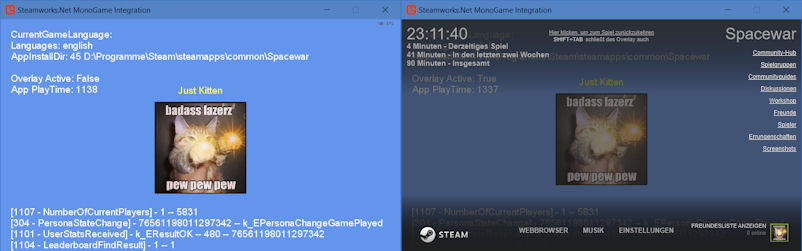

# Steamworks.Net MonoGame Integration (DesktopGL)
This repo is for everyone who is about to integrate the Steamworks.Net.dll into a MonoGame project.  It shows some Steamworks.Net features and how easy it is to integrate it into a MonoGame project.




### Building

The following is required to successfully compile the solution:

- MonoGame 3.6 (DesktopGL) []
- [Steamworks.Net](https://github.com/rlabrecque/Steamworks.NET) Precompiled .dlls are included in this repo. They are targeting **Steam SDK 1.39** (Steamworks.Net 9.0.0)

### How To

To set up your own MonoGame with Steamworks.Net integration project you need to do the following steps:

- Add the **Steamworks.Net.dll** as a reference
- Add **CSteamworks.dll** as a new file to the project and set "copy to output directory" to "copy if newer"
- Add **steam_api.dll** as a new file to the project and set "copy to output directory" to "copy if newer"
- Add **steam_appid.txt** as a new file to the project and set "copy to output directory" to "copy if newer"
- Add your desired **Steamworks AppID** to the steam_appid.txt file
- Initialize the API with the method **SteamAPI.Init()** like this:

```cs
using Steamworks;

protected override void Initialize()
{
    try
    {
        if (!SteamAPI.Init()) Console.WriteLine("SteamAPI.Init() failed!");
        else isSteamRunning = true;
    }
    catch (DllNotFoundException e)
    {
        Console.WriteLine(e);
    }
}
```

- Update callbacks with **SteamAPI.RunCallbacks();** like this:

```cs
protected override void Update(GameTime gameTime)
{
    if (isSteamRunning == true) SteamAPI.RunCallbacks();

    base.Update(gameTime);
}
```

- ShutDown the Api with **SteamAPI.Shutdown();** like this:

```cs
private void Game1_Exiting(object sender, EventArgs e)
{
    SteamAPI.Shutdown();
}
```
> Add the EventHandler **Exiting += Game1_Exiting** and then the SteamAPI.Shutdown() method.

## Samples

- **Hello Steamworks.Net.csproj**: Simple sample which sets up bare basics of Steamworks.Net and displaying a welcome message which includes your steam user name.
- **Steamworks.Net MonoGame Integration.csproj**: Extendend sample which shows some features of Steamworks.Net like UserStats, PersonaState, LeaderboardData, NumberOfCurrentPlayers, Steam User Avatar and so on.

> Note: You need to start your steam client before executing the examples. Otherwise you won't receive any data -obviously ;)

**Have fun!**
