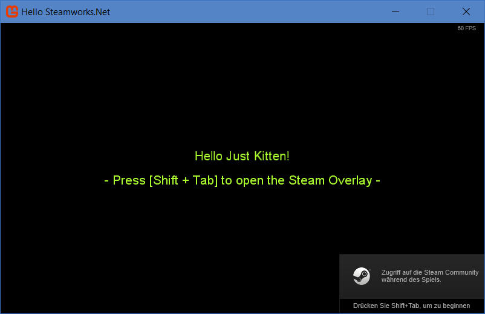
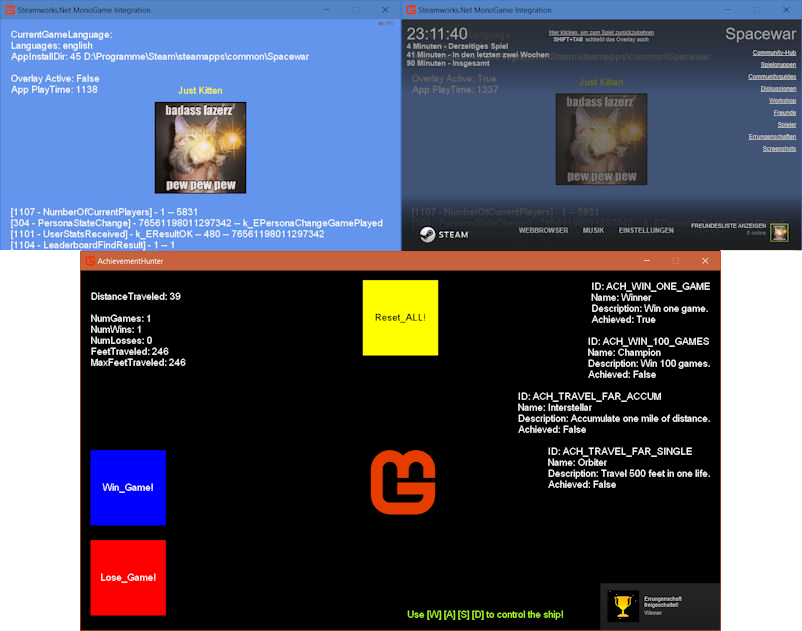

[](https://twitter.com/sqrMin1)

# Steamworks.Net MonoGame Integration
This repo is for everyone who is about to integrate the Steamworks.Net.dll into a MonoGame project. It shows some Steamworks.Net features and how easy it is to integrate it into a MonoGame project.




### Building

The following is required to successfully compile the solution:

- MonoGame 3.6
- [Steamworks.Net](https://github.com/rlabrecque/Steamworks.NET) Precompiled .dlls are included in this repo. They are targeting **Steam SDK 1.42** (Steamworks.Net 11.0.0)

### How To

To set up your own MonoGame with Steamworks.Net integration project you need to do the following steps:

- Add the **Steamworks.Net.dll** as a reference
- Add **steam_api.dll** as a new file to the project and set "copy to output directory" to "copy if newer"
- Add **steam_appid.txt** as a new file to the project and set "copy to output directory" to "copy if newer"

  - Don't forget to add that file as a ```FileExclusion``` to your Steamworks build-script since you don't want that file to be copied to your customer's destination directory, since it's for debugging purposes only (it lets you try all the steam-stuff without actually having that game listed and active on steam and is important for debugging directly from out of Visual Studio).
    Your ```depot_build_xxxxxx.vdf``` you're referencing in your ```app_build_xxxxxx.vdf``` should end like this:

    ``````
    	// but exclude all symbol files  
    	// This can be a full path, or a path relative to ContentRoot
      "FileExclusion" "*.pdb"
      "FileExclusion" "steam_appid.txt"
    }
    ``````

- Add your desired **Steamworks AppID** to the steam_appid.txt file

- Initialize the API with the method **SteamAPI.Init()** like this:

```cs
using Steamworks;

protected override void Initialize()
{
    try
    {
        if (!SteamAPI.Init()) Console.WriteLine("SteamAPI.Init() failed!");
        else isSteamRunning = true;
    }
    catch (DllNotFoundException e)
    {
        Console.WriteLine(e);
    }
}
```

- Update callbacks with **SteamAPI.RunCallbacks();** like this:

```cs
protected override void Update(GameTime gameTime)
{
    if (isSteamRunning == true) SteamAPI.RunCallbacks();

    base.Update(gameTime);
}
```

- ShutDown the Api with **SteamAPI.Shutdown();** like this:

```cs
private void Game1_Exiting(object sender, EventArgs e)
{
    SteamAPI.Shutdown();
}
```

> Add the EventHandler **Exiting += Game1_Exiting** and then the SteamAPI.Shutdown() method.

You should be able to build and run the project now. 
It may be possible that you will receive the following exception:

```js
An unhandled exception of type 'System.BadImageFormatException' occurred in SWTEST.exe

Additional information: Could not load file or assembly 
'Steamworks.NET, Version=9.0.0.0, Culture=neutral, PublicKeyToken=null' 
or one of its dependencies. 
An attempt was made to load a program with an incorrect format.
```

In this case you need to make sure, that you took the right assemblies for your target platform. 
E.g. When you took the assemblies from the repo directory 
"Steamworks.Net-MonoGame-Integration/Steamworks.NET/Windows-x86/", then you need to configure
your project to build it for the x86 platform. Use the integrated configuration manager 
to create or choose the right platform. It will look like this:


You should also define the right "conditional compilation symbols":


Type in "WINDOWS", when building for the windows platform and "LINUX", when building for linux.

Latest now it should build without an exception.

## Samples

- **Hello Steamworks.Net**: Simple sample which sets up bare basics of Steamworks.Net and displaying a welcome message which includes your steam user name.
- **AchievementHunter**: Simple sample which shows you the correct way of implementing achievements and stats as well as storing them on the steam server. It's based upon the Steamworks Example 'SpaceWar' included with the Steamworks SDK. 
- **Steamworks.Net MonoGame Integration**: Extendend sample which shows some features of Steamworks.Net like UserStats, PersonaState, LeaderboardData, NumberOfCurrentPlayers, Steam User Avatar and so on.

> Note: You need to start your steam client before executing the examples. Otherwise you won't receive any data -obviously ;)

**Have fun!**

[](https://twitter.com/sqrMin1)
